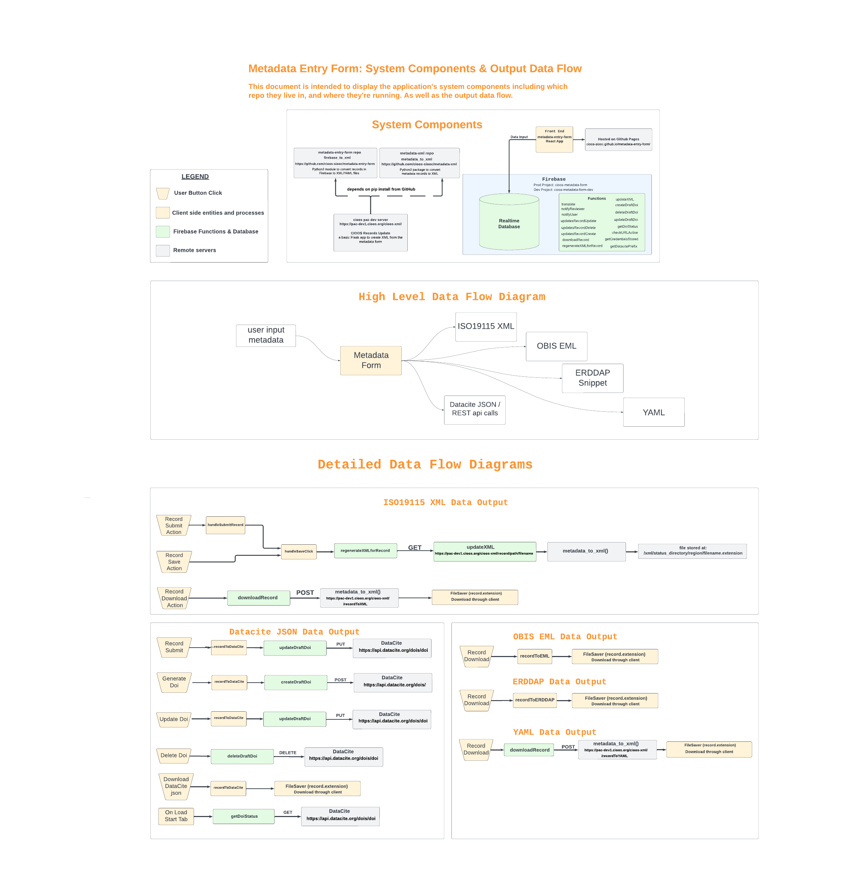

# metadata-entry-form

[](https://github.com/cioos-siooc/metadata-entry-form/actions/workflows/run-build-tests.yaml)
[](https://www.gnu.org/licenses/agpl-3.0)

CIOOS Metadata entry form 

Production: <https://form.cioos.ca>
Development: <https://cioos-metadata-form-dev-258dc--development-tc36g7it.web.app/>

## Project Goal
The primary goal of this project is to provide a user-friendly web interface for creating, editing, and managing metadata records for the Canadian Integrated Ocean Observing System (CIOOS). It facilitates the collection of high-quality metadata that complies with standards (ISO 19115), supports bilingual content (English/French), and integrates with external systems like GitHub and DataCite (for DOIs).

## System Architecture

Below is the system architecture diagram which provides an overview of the data flow and interaction between components within the application:



For a more interactive and detailed view, see the [Lucidchart Diagram](https://lucid.app/lucidchart/d9fd139b-9705-45c0-b264-930e94dbd88d/edit?viewport_loc=-881%2C-64%2C10027%2C5945%2C0_0&invitationId=inv_80257c7b-9a79-433a-aa33-e95d87793fa4).

### High-Level Components
*   **Frontend**: A Single Page Application (SPA) built with React 19 using Vite. Uses Material-UI (MUI v7) for UI and React-Leaflet for maps.
*   **Backend**: Firebase Functions (Node.js and Python) handling business logic, triggers, and API endpoints.
*   **Database**: Firebase Realtime Database for storing metadata records and user data.
*   **Authentication**: Firebase Authentication.
*   **External Integrations**: GitHub (for publishing records), DataCite (for DOI minting).

## Project Structure & Key Concepts

### Frontend (`src/`)
*   **`src/components/Pages/`**: Top-level route components (`MetadataForm.jsx`, `Submissions.jsx`, `Admin.jsx`, `Reviewer.jsx`).
*   **`src/components/FormComponents/`**: Reusable UI inputs (e.g., `BilingualTextInput`, `MapSelect`, `ContactEditor`).
*   **`src/utils/`**: Core logic independent of UI.
    *   `blankRecord.js`: Defines the JSON schema of a new metadata record.
    *   `validate.js`: Validation rules mapping fields to error messages and tabs.
    *   `firebase.js`: Firebase SDK initialization.

### Backend (`firebase-functions/`)
Serverless backend using Firebase Cloud Functions (Gen 2).
*   **JavaScript (`functions/`)**: Node.js 22 runtime. Handles triggers (DB updates), notifications, translations, and GitHub publishing.
*   **Python (`python-functions/`)**: Python 3.11 runtime. Handles heavy data processing (XML conversion).

### Data Model & Validation
*   Metadata records are stored in Firebase. The schema is defined implicitly by `src/utils/blankRecord.js`.
*   A record contains bilingual fields (objects with `en`/`fr` keys).
*   Validation is defined in `src/utils/validate.js`.

### Internationalization (i18n)
The app is bilingual (English/French). Content fields are stored as `{ en: "...", fr: "..." }`.

## Local Development Installation

To simplify the local development, we highly recommend to clone the repo locally and integrate it via vscode within the predefined Dev Container. 

In the container, run the following steps:

1. Copy `.env.sample` to `.env`
  ```shell
  cp .env.sample .env
  ```
2. Login with firebase
  ```shell
  firebase login
  ```
3. Select firebase project:
  ```shell
  firebase use dev
  ```

4. Go to firebase-functions directory and start the emulator, this will install the javascript and python functions dependancies and activate the firebase local emulator :
  ```shell
  cd firebase-functions
  bash emulate-functions.sh 
  ```
5. In a second terminal, start the frontent in development. From the base directory of this project run:
  ```
  npm install
  npm start
  ```

## Monitoring

Monitoring of production site availability is done via the [cioos-upptime](https://github.com/cioos-siooc/cwatch-upptime) and notices are posted to the CIOOS cwatch-upptime slack channel. Error collection is performed by sentry and reported in the [cioos-metadata-entry-form](https://cioos.sentry.io/projects/cioos-metadata-entry-form/) project.


## Deployment Overview

### Frontend Deployment

- **Development**: Firebase Hosting preview sites are created for all pull requests and commits to the `development` branch. Check the pull request comments on GitHub for preview links. Handled by the `firebase-hosting-pull-request.yml` GitHub action. Preview sites are deleted after 30 days of inactivity.
- **Production**: Deploys to GitHub Pages (<https://cioos-siooc.github.io/metadata-entry-form/>) only on version tags (e.g., `v1.0.0`). Handled by the `github-pages-deploy.yaml` GitHub action.

### Firebase Functions Deployment

Firebase Functions deploy automatically on version tags (`v*`) to production and on commits to the `development` branch or pull requests to development. Manual redeploys of production tags require repository admin approval.

#### Automated Deployments

- **Development**: Commits to the `development` branch automatically deploy Firebase Functions to the development Firebase project
- **Pull Requests**: Functions changes in pull requests automatically deploy to the development project for testing
- **Production**: Version tags (e.g., `v1.0.0`) automatically deploy to the production Firebase project. Both frontend and functions are deployed together.

#### Manual Redeployment (Admin Only)

Repository admins can manually redeploy a previously-released version tag to production. Triggering either workflow automatically triggers the other with the same tag.

**To redeploy both frontend and functions together:**
1. Go to the "Actions" tab in the GitHub repository
2. Select either:
   - `Deploy firebase functions` workflow, OR
   - `Build and Deploy to Github pages` workflow
3. Click "Run workflow"
4. Enter the tag name to deploy (e.g., `v1.0.0`)
5. Click "Run workflow"

**How it works:**
- If you trigger `Deploy firebase functions`, it deploys functions first, then automatically triggers the GitHub Pages workflow
- If you trigger `Build and Deploy to Github pages`, it deploys the frontend first, then automatically triggers the Firebase Functions workflow
- Both workflows verify you are a repo admin and validate the tag exists before deploying
- Loop prevention: The cross-triggered workflow deploys but does not trigger the other workflow back

**Note**: Only repository admins can trigger manual deployments.

### Deploying to Development Project (Local)

To deploy updated Firebase functions locally to the "cioos-metadata-form-dev-258dc" development project:

1. **Login** to firebase

    ```bash
    firebase login
    ```

2. **Select the development Firebase project**:

    ```bash
    firebase use cioos-metadata-form-dev-258dc
    ```

3. **Make necessary changes to your Firebase functions.**

4. **Deploy the changes from the `./firebase-functions/functions` directory**:

    ```bash
    firebase deploy --only functions
    ```

**Automated GitHub-based deployments**: Pull requests and commits to the `development` branch automatically deploy to the development project via GitHub Actions, so manual local deploys are only needed for quick testing.

#### GitHub Secrets and .env File Creation

The workflow utilizes the following secrets to create the virtual `.env` file for the deployment process:

```env
# Email notifications account (do not commit real credentials)
GMAIL_USER=
GMAIL_PASS=

# Cohere API key for translations
COHERE_API_KEY=

# GitHub token (repo + pages scopes) for issue generation
GITHUB_AUTH=

# Environment settings
# Set VITE_DEV_DEPLOYMENT to true to connect to dev Firebase project
VITE_DEV_DEPLOYMENT=false

# Use local emulators for Firebase services
# Note: if using local emulators, ensure the emulators are running (firebase emulators:start)
VITE_FIREBASE_LOCAL_FUNCTIONS=true
VITE_FIREBASE_LOCAL_DATABASE=false

# Google Cloud API keys
# Prod project: https://console.cloud.google.com/apis/credentials?project=cioos-metadata-form-8d942
VITE_GOOGLE_CLOUD_API_KEY=
# Dev project: https://console.cloud.google.com/apis/credentials?project=cioos-metadata-form-dev-258dc
VITE_GOOGLE_CLOUD_API_KEY_DEV=
```

### Using Parameterized Configuration in Firebase Functions

Our Firebase Functions leverage parameterized configuration for managing sensitive information. This helps prevent functions from being deployed with missing configurations/credentials.

For details on defining and accessing these parameters, refer to the [official Firebase documentation](https://firebase.google.com/docs/functions/config-env?gen=1st).

#### Deployment Considerations with Parameters

- **Local Development**: Use a `.env` file within the `functions` directory for local development, mirroring the setup of parameters used in production environments.
- **Firebase CLI Prompt**: The CLI may prompt for parameter values during deployment if they are not preset, ensuring functions are correctly configured.
- **Firebase Console Management**: Parameters can also be managed within the Firebase Console.

### Security Considerations

The use of GitHub Secrets and the creation of a virtual `.env` file during the workflow run ensures that sensitive information is handled securely, without persisting in the repository or exposing it beyond the lifecycle of the workflow execution. 

- **Exclude `.env` Files from Version Control**: Ensure `.env` files are not included in version control to prevent exposure of sensitive data.
- **Temporary `.env` Files**: The `.env` file created during the GitHub Actions workflow is virtual and transient. It exists only for the duration of the workflow run and is not committed to the repository.

## Deploying Firebase Realtime Database Security Rules

### Overview

Deploying Firebase Realtime Database security rules via the Firebase CLI is recommended to facilitate version control and consistency across development workflows.

### Setting Up Rules

- **Edit Rules**: Modify the Realtime Database security rules directly in the `database.rules.json` file.
- **Version Control**: Ensure the rules file is tracked in git to maintain a history of changes.

### Define targets

This project has two databases: `cioos-metadata-form-8d942` (this is the default/main db for production) and `cioos-metadata-form-dev-258dc` (dev). 
Use Firebase CLI targets to manage rules deployment:

```bash
firebase target:apply database prod cioos-metadata-form-8d942
firebase target:apply database dev cioos-metadata-form-dev-258dc
```

### Configure firebase.json

Update your `firebase.json` to map `.rules` files to your targets.
```json
{
  "database": [
    {
      "target": "prod",
      "rules": "database.rules.json"
    },
    {
      "target": "dev",
      "rules": "database.rules.json"
    }
  ]
}
```

### Deployment

Deploy your database rules using the Firebase CLI:

```bash
# Deploy to a specific environment
firebase deploy --only database:dev  # For development
firebase deploy --only database:prod # For production
```

#### Important Considerations

- **Deployment Overrides**: Deploying via the Firebase CLI overwrites any existing rules in the Firebase console. Ensure the `.rules` file reflects the latest ruleset. Keep the rules file in sync with any console edits to avoid unintended overwrites.
- **Version Control**: Use version control to track changes and collaborate on rule development.
- **Testing**: Thoroughly test your rules in a development or staging environment before deploying to production.

Review the [Firebase CLI documentation](https://firebase.google.com/docs/cli) for more details on managing project resources.


## GitHub Publishing

Reviewers and Admins can publish metadata records directly to a GitHub repository (e.g., `cioos-siooc/cioos-siooc-forms`).

### Configuration

1.  Go to the Admin page for your region.
2.  Locate the "GitHub Publishing Configuration" section.
3.  Enter the repository details (Owner, Name, Branch).
4.  Provide a GitHub Personal Access Token (PAT) with `repo` scope.
    *   Note: The token is stored in Firebase and protected by security rules.
5.  Configure file naming template (default `{filename}`) and target environments (e.g. `prod`, `dev`).

### Publishing a Record

1.  Go to the Reviewer page.
2.  Find a Submitted or Published record.
3.  Click the "Cloud Upload" icon (Publish to GitHub).
4.  Select the target environments.
5.  Optionally provide a commit message.
6.  Click Publish.

The system will generate XML and YAML files and commit them to the configured GitHub repository under `forms/{region}/{environment}/{filename}.{xml|yaml}`.


## Hosting on github and Authentication

When hosting the application in a new place there are a couple of things to update. 

- You must add your new domain to the allowed list for authenication in firebase.
  https://console.firebase.google.com/u/0/project/cioos-metadata-form/authentication/settings
  https://console.firebase.google.com/u/0/project/cioos-metadata-form-dev-258dc/authentication/settings

- You have to allow your domain under Website restrictions for the firebase browser key
  https://console.cloud.google.com/apis/credentials/key/405d637a-efd4-48f5-95c6-f0af1d7f4889?project=cioos-metadata-form
  https://console.cloud.google.com/apis/credentials/key/23d360a3-4b55-43f2-bc1c-b485371c0e07?project=cioos-metadata-form-dev-258dc