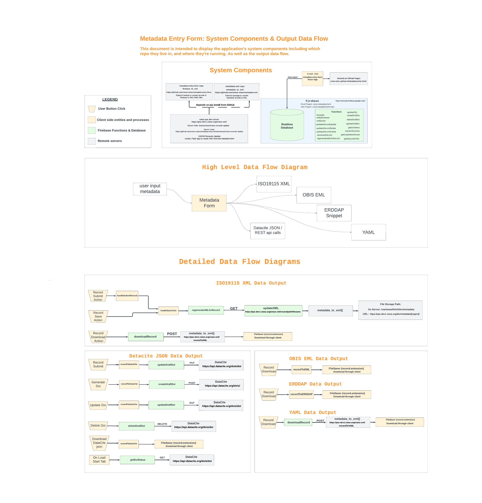

# metadata-entry-form

[](https://github.com/cioos-siooc/metadata-entry-form/actions/workflows/run-build-tests.yaml)
[](https://www.gnu.org/licenses/agpl-3.0)

CIOOS Metadata entry form

## System Architecture

Below is the system architecture diagram which provides an overview of the data flow and interaction between components within the application:



For a more interactive and detailed view, see the [Lucidchart Diagram](https://lucid.app/lucidchart/d9fd139b-9705-45c0-b264-930e94dbd88d/edit?viewport_loc=-881%2C-64%2C10027%2C5945%2C0_0&invitationId=inv_80257c7b-9a79-433a-aa33-e95d87793fa4).

## Installation

1. Install [Node](https://nodejs.org/en/download/)

2. In this directory, run `npm install`

## Running development mode

`npm start`

This will start a hot-reloading dev server. Click on the link that it outputs to open in your browser.

## Monitoring

Monitoring of production site availability is done via the [cioos-upptime](https://github.com/cioos-siooc/cwatch-upptime) and notices are posted to the CIOOS cwatch-upptime slack channel. Error collection is performed by sentry and reported in the [cioos-metadata-entry-form](https://hakai-institute.sentry.io/projects/cioos-metadata-entry-form/) project.

### Running the Firebase emulator

#### Local Install Alternative

Install firebase CLI [as described here](https://firebase.google.com/docs/emulator-suite/install_and_configure).

Run `firebase emulators:start` from the `firebase-functions/functions` directory.
Redirect function calls to this emulator by uncommenting the call to `connectFunctionsEmulator` in [src/firebase.js](src/firebase.js).


## Deploy to production site at GitHub pages

Pushes to master automatically deploy to <https://cioos-siooc.github.io/metadata-entry-form/>

Or manually deploy any branch with

`npm run deploy`

## Deploy to dev preview sites

firebase hosted preview sites are created for all pull requests. Once a pull request is generated, check the pull request comments on github for the link to the preview site. Deployment is handled by the `firebase-hosting-pull-request.yml` github action. Preview sites are deleted during a pull request close event or after 30 days of inactivity on the pull request. Any commit to the pull request branch will reset the timer.

## Deployment and Configuration of Firebase Functions

Our Firebase Functions infrastructure utilizes both GitHub Actions for automated and manual deployments and parameterized configuration for management of environment variables and credentials.

### Automated and Manual Deployment with GitHub Actions

We use a GitHub Actions workflow named `firebase-deploy` for deploying Firebase Functions. This workflow is triggered automatically on push to the main branch but can also be executed manually for feature branches.

#### Workflow Features

- **Automated Deployments on Push to Main**: Ensures that any changes merged into the main branch are automatically deployed to Firebase.
- **Manual Deployment Option**: Allows for manual deployments of specific branches, useful for testing changes in feature branches. 
- **Environment Variables and Secrets**: Uses GitHub Secrets to populate a virtual `.env` file with necessary configurations for the deployment process.

#### Manual Deployment Steps

1. Go to the "Actions" tab in the GitHub repository.
2. Select the `firebase-deploy` workflow.
3. Click "Run workflow", select the branch to deploy, and initiate the workflow.

### Deploying to Development Project

To deploy updated Firebase functions to the "cioos-metadata-form-dev-258dc" development project, follow these steps:

1. **Ensure your local setup is linked to the correct Firebase project** by using the Firebase CLI to login and select the "cioos-metadata-form-dev-258dc" project.

    ```bash
    firebase use cioos-metadata-form-dev-258dc
    ```

2. **Make necessary changes to your Firebase functions.**

3. **Deploy the changes by running the command:**
From the `./firebase-functions/functions` directory run the command:

    ```bash
    firebase deploy --only functions
    ```

This will deploy the updated functions to the development project. The GitHub Action for deploying to the preview URL is already configured to use this development project, ensuring that any previews generated from pull requests will interact with the updated dev functions instead of the production version.

#### GitHub Secrets and .env File Creation

The workflow utilizes the following secrets to create the virtual `.env` file for the deployment process:

- `GMAIL_USER` notifications
- `GMAIL_PASS` notifications
- `AWS_REGION` used for amazon translate service access
- `AWS_ACCESSKEYID` used for amazon translate service access
- `AWS_SECRETACCESSKEY` used for amazon translate service access
- `GITHUB_AUTH` used to push to github pages branch and other github action type stuff
- `REACT_APP_DEV_DEPLOYMENT` used to switch between development and production databases. Default False, set to True to use Dev database
- `REACT_APP_GOOGLE_CLOUD_API_KEY` found at https://console.cloud.google.com/apis/credentials?project=cioos-metadata-form
- `REACT_APP_GOOGLE_CLOUD_API_KEY_DEV` found at https://console.cloud.google.com/apis/credentials?project=cioos-metadata-form-dev-258dc

### Using Parameterized Configuration in Firebase Functions

Our Firebase Functions leverage parameterized configuration for managing sensitive information. This helps prevent functions from being deployed with missing configurations/credentials.

For details on defining and accessing these parameters, refer to the [official Firebase documentation](https://firebase.google.com/docs/functions/config-env?gen=1st).

#### Deployment Considerations with Parameters

- **Local Development**: Use a `.env` file within the `functions` directory for local development, mirroring the setup of parameters used in production environments.
- **Firebase CLI Prompt**: The CLI may prompt for parameter values during deployment if they are not preset, ensuring functions are correctly configured.
- **Firebase Console Management**: Parameters can also be managed within the Firebase Console.

### Security Considerations

The use of GitHub Secrets and the creation of a virtual `.env` file during the workflow run ensures that sensitive information is handled securely, without persisting in the repository or exposing it beyond the lifecycle of the workflow execution. 

- **Exclude `.env` Files from Version Control**: Ensure `.env` files are not included in version control to prevent exposure of sensitive data.
- **Temporary `.env` Files**: The `.env` file created during the GitHub Actions workflow is virtual and transient. It exists only for the duration of the workflow run and is not committed to the repository.

## Deploying Firebase Realtime Database Security Rules

### Overview

Deploying Firebase Realtime Database security rules via the Firebase CLI is recommended to facilitate version control and consistency across development workflows.

### Setting Up Rules

- **Edit Rules**: Modify the Realtime Database security rules directly in the `database.rules.json` file.
- **Version Control**: Ensure the rules file is tracked in git to maintain a history of changes.

### Define targets

This project has two databases: `cioos-metadata-form-8d942` (this is the default/main db for production) and `cioos-metadata-form-dev-258dc` (dev). 
Use Firebase CLI targets to manage rules deployment:

```bash
firebase target:apply database prod cioos-metadata-form-8d942
firebase target:apply database dev cioos-metadata-form-dev-258dc
```

### Configure firebase.json

Update your `firebase.json` to map `.rules` files to your targets.
```json
{
  "database": [
    {
      "target": "prod",
      "rules": "database.rules.json"
    },
    {
      "target": "dev",
      "rules": "database.rules.json"
    }
  ]
}
```

### Deployment

Deploy your database rules using the Firebase CLI:

```bash
# Deploy to a specific environment
firebase deploy --only database:dev  # For development
firebase deploy --only database:prod # For production
```

#### Important Considerations

- **Deployment Overrides**: Deploying via the Firebase CLI overwrites any existing rules in the Firebase console. Ensure the `.rules` file reflects the latest ruleset. Keep the rules file in sync with any console edits to avoid unintended overwrites.
- **Version Control**: Use version control to track changes and collaborate on rule development.
- **Testing**: Thoroughly test your rules in a development or staging environment before deploying to production.

Review the [Firebase CLI documentation](https://firebase.google.com/docs/cli) for more details on managing project resources.


## Hosting on github and Authentication

When hosting the application in a new place there are a couple of things to update. 

- You must add your new domain to the allowed list for authenication in firebase.
  https://console.firebase.google.com/u/0/project/cioos-metadata-form/authentication/settings
  https://console.firebase.google.com/u/0/project/cioos-metadata-form-dev-258dc/authentication/settings

- You have to allow your domain under Website restrictions for the firebase browser key
  https://console.cloud.google.com/apis/credentials/key/405d637a-efd4-48f5-95c6-f0af1d7f4889?project=cioos-metadata-form
  https://console.cloud.google.com/apis/credentials/key/23d360a3-4b55-43f2-bc1c-b485371c0e07?project=cioos-metadata-form-dev-258dc

  